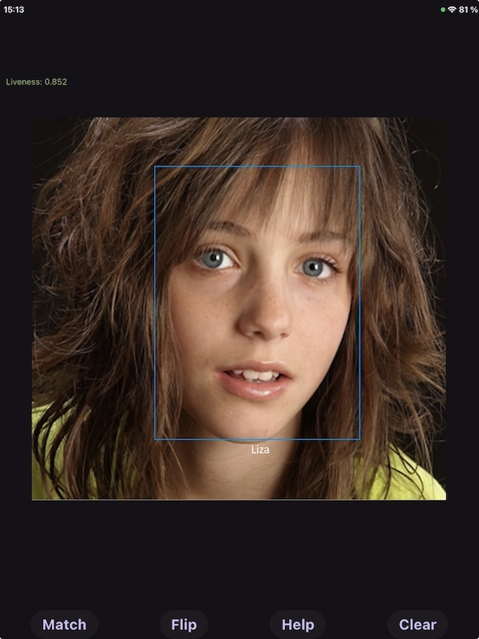
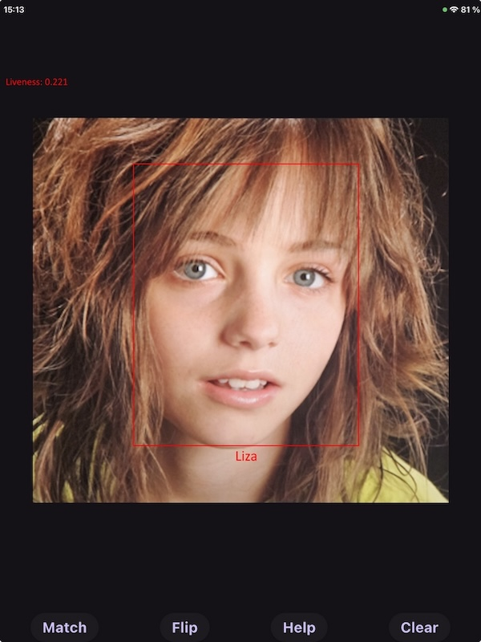

## [FaceSDK](https://www.luxand.com/facesdk/?utm_source=github&utm_medium=readmd&utm_campaign=header) · [CloudAPI](https://luxand.cloud/?utm_source=github&utm_medium=readmd&utm_campaign=header) · [LinkedIn](https://www.linkedin.com/company/luxand-inc.) · [Contact](mailto:support@luxand.com)


 

### NIST-approved

Luxand's FaceSDK ranked within the top 21.8% by the National Institute of Standards and Technology (NIST) during the Face Recognition Vendor Test (FRVT).


### iBeta Certified Liveness

The iBeta certified Liveness add-on for FaceSDK aced Level 1 Presentation Attack Detection (PAD) testing, following ISO/IEC 30107-3 standards. 

# FaceSDK \- Flutter (iOS, Android)

##   

## Face Detection and Recognition

Luxand FaceSDK 9.0 ships a new detection and recognition pipeline. The accuracy of face detection and recognition is significantly improved compared to the previous release.

The face template is **1040 bytes**. Templates saved by an earlier version cannot be read by this one.

`MatchFaces` returns the similarity value which is always in the range [0, 1] and 0.5 means "unrelated". A threshold of 0.64 gives good results in our tests.

The classes used by detection are shown below.

```dart
class Point extends Struct {
  @Int32()
  external int x;

  @Int32()
  external int y;
}

class PointF extends Struct {
  @Float()
  external double x;

  @Float()
  external double y;
}

class BBox extends Struct {
  external Point p0, p1;
}

class FeaturePoints extends Struct {
  @Array(5)
  external Array<Point> points;
}

class Face extends Struct {
  @Float()
  external double score;

  @Float()
  external double angle;

  external BBox bbox;
  external FeaturePoints features;
}
```

*`p0` and `p1` are the top left and bottom right corners of the face bounding box.
`features` holds the 5 points detected on the face: eye centers, nose and mouth corners.
`score` is the detection confidence and `angle` the in-plane rotation of the face.*

*`FSDK.Face` is the class you actually work with; the listing above is the native layout it
wraps. Besides `bbox` and `features` it exposes `left` / `top` / `right` / `bottom`,
`width` / `height` and `center()`, so you rarely need to reach into `bbox` yourself. Use
`FSDK.Faces` when working with the `DetectMultipleFaces` function.*

```dart
FSDK.DetectFace(FSDK.Image image, {FSDK.Face? face});
```

*Detects and returns a single face on the given image. If multiple faces are present, the function returns the one with the highest confidence. Setting the second argument is more efficient because it avoids the need to allocate memory for the face structure. You can also use this function from the Image class as follows:* ```FSDK.Face face = image.detectFace();```

```dart
FSDK.DetectMultipleFaces(FSDK.Image image, {FSDK.Faces? faces, int maxSize = 256});
```

*Detects multiple faces on the given image. The faces are sorted by confidence in descending order. Also available as* ```image.detectMultipleFaces()```.

```dart
FSDK.GetFaceTemplate(FSDK.Image image, {FSDK.FaceTemplate? faceTemplate});
```

*Obtains a face template for the face with the most confidence on the image (as returned by the `DetectFace` function). Also available as* ```image.getFaceTemplate()```.

```dart
FSDK.GetFaceTemplateInRegion(FSDK.Image image, FSDK.Face face, {FSDK.FaceTemplate? faceTemplate});
```

*Obtains a face template for the given `face`. Also available as* ```image.getFaceTemplateInRegion(face)```.

### Configuring Face Detection and Recognition

Parameters are set using the `FSDK.SetParameter` or `FSDK.SetMultipleParameters` functions (see [documentation](https://www.luxand.com/facesdk/documentation/configuration.php)). The available parameters are listed below.

#### Face Detection

| Parameter | Description | Default Value | Accepted Values |
| :---      | :---        |     :---:     | :---            |
| FaceDetectionModel | Path to the face detection model file to load | default | File path or the string `"default"` |
| FaceDetectionThreshold | Face detection threshold | 0.64 | Floating point value from the range [0, 1] |
| FaceDetectionBatchSize | Number of image patches processed at the same time for face detection | 1 | Positive integer |
| FaceDetectionPatchSize | Size of a single image patch | the model's own input size | Positive integer. Higher values decrease performance, but allow detection of smaller faces |
| FaceDetectionPatchMode | Image patching algorithm to use | fast | <p>`"fast"` &mdash; resizes the image to `FaceDetectionPatchSize` and performs detection on a single patch</p> <p>`"full"` &mdash; splits the image into overlapping patches of size `FaceDetectionPatchSize` and performs detection on every patch separately combing the results afterwards</p> <p>`"mixed"` &mdash; if the image size is at least twice as big as `FaceDetectionPatchSize` chooses `"full"` otherwise chooses `"fast"` |
| FaceDetectionBigFaceSize | Faces at least this large are detected on the whole image rather than per patch | 384 | Positive integer |
| TrimOutOfScreenFaces | Clip bounding boxes that extend past the image border | true | `"false"` or `"true"` |
| FaceDetectionComputationDelegate | Computation delegate to use for face detection | cpu | <p>`"none"` &mdash; run on CPU without SIMD optimizations</p> <p>`"cpu"` &mdash; run on CPU with SIMD optimizations</p> <p>`"gpu"` &mdash; run on GPU</p> <p>`"nnapi"` &mdash; run using [NNAPI](https://developer.android.com/ndk/guides/neuralnetworks)</p> |
| FaceDetectionNumThreads | Number of threads used for face detection | automatic | Positive integer |

#### Face Recognition

| Parameter | Description | Default Value | Accepted Values |
| :---      | :---        |     :---:     | :---            |
| FaceRecognitionModel | Path to the face recognition model file to load | default | File path or the string `"default"` |
| FaceRecognitionUseFlipTest | Additionally use mirrored image when creating face template | false | `"false"` or `"true"` |
| FaceRecognitionBatchSize | Number of faces processed at the same time | 1 | Positive integer |
| FaceRecognitionComputationDelegate | Computation delegate to use for face recognition | cpu | Same values as `FaceDetectionComputationDelegate` |
| FaceRecognitionNumThreads | Number of threads used for face recognition | automatic | Positive integer |

#### Facial Features

| Parameter | Description | Default Value | Accepted Values |
| :---      | :---        |     :---:     | :---            |
| FacialFeaturesModel | Path to the facial features model file to load | default | File path or the string `"default"` |
| FacialFeaturesComputationDelegate | Computation delegate to use for facial feature detection | cpu | Same values as `FaceDetectionComputationDelegate` |
| FacialFeaturesNumThreads | Number of threads used for facial feature detection | automatic | Positive integer |

`ComputationDelegate` and `ModelNumThreads` set the delegate and the thread count for every
model at once.

### Face Detection and Recognition in Tracker

The new detection and recognition are always used by the Tracker — the `DetectionVersion`
parameter of the previous release no longer exists.

All of the parameters above can be set for the Tracker using the `FSDK.SetTrackerParameter` and `FSDK.SetTrackerMultipleParameters` functions (see [documentation](https://www.luxand.com/facesdk/documentation/trackerfunctions.php#FSDK_SetTrackerParameter)), or through the `Tracker` class:

```dart
tracker.setMultipleParameters({
  'FaceDetectionPatchSize': 256,
});
```

The Tracker overrides two of the detection defaults listed above: it uses
`FaceDetectionThreshold=0.4` and `FaceDetectionPatchSize=256`.

## Managing Face Templates in Tracker Memory

The following functions can be used to synchronize Tracker Memory between different devices.

Since the list of IDs in the Tracker may change during operation (for example, two IDs may be merged), it is not recommended to work with the Tracker (i.e., call `FSDK.FeedFrame`) while using the following functions. Also, you must call the following function beforehand (see [FAQ](https://www.luxand.com/facesdk/faq.php)):

```dart
tracker.setParameter("VideoFeedDiscontinuity", "false");
```
Below is the list of functions for direct access to the Tracker Memory face templates.

```dart
int idCount = tracker.getIDsCount();
```

*Returns the number of `IDs` (persons) in the Tracker's database.*

```dart
FSDK.Int64Buffer ids = tracker.getAllIDs();
```

*Returns a list of all the `IDs` in the Tracker.*

```dart
int personId = tracker.getIDByFaceID(faceID);
```

*Returns the person `ID` for the given `FaceID`. This function may be useful when the person `ID` changes during Tracker operation while the `FaceID` of the template remains unchanged, or when the `ID` is simply unknown. The `FaceID` always remains unchanged.*

```dart
int faceIdsCount = tracker.getFaceIDsCountForID(id);
```

*Returns the number of face templates in the Tracker's database for the specified `ID` (person).*

```dart
FSDK.Int64Buffer faceIds = tracker.getFaceIDsForID(id);
```

*Returns a list of all the `FaceIDs` for the specified `ID` (person).*

```dart
FSDK.FaceTemplate faceTemplate = tracker.getFaceTemplate(faceID);
```

*Returns the face template for the specified `FaceID`. The template is 1040 bytes long.*

```dart
FSDK.TrackerCreateIDResult id = tracker.createID(faceTemplate);
```

*Creates a new person `ID` and adds the provided template to it. Returns a `TrackerCreateIDResult` carrying the new person `ID` and the associated `FaceID`.*

```dart
int faceID = tracker.addFaceTemplate(id, faceTemplate);
```

*Adds a new template to an existing person `ID` and returns the `FaceID`.*

```dart
tracker.deleteFace(faceID);
```

*Deletes the face template with the specified `FaceID`. If this is the last template for the person, the person `ID` will also be removed.*

```dart
FSDK.Image image = tracker.getFaceImage(faceID);
```

*Returns the face image for the specified `FaceID`. The dimensions are 112x112. Face images are stored when the `KeepFaceImages` Tracker parameter is `true`. If the image is not present, the function throws `FSDK.FaceImageNotFoundError`.*

```dart
tracker.setFaceImage(faceID, faceImage);
```

*Sets the face image for the specified `FaceID`. The dimensions of the provided `Image` must be 112x112. If an image already exists for the `FaceID`, it will be replaced.*

```dart
tracker.deleteFaceImage(faceID);
```

*Deletes the face image for the specified `FaceID` from the `tracker's` database. If no image is present, the function does nothing.*

```dart
class IDSimilarity extends Struct {
  @Int64()
  external int id; // ID Of a person

  @Float()
  external double similarity; // similarity
}

FSDK.IDSimilarities results = tracker.matchFaces(faceTemplate, threshold);
```

*Returns an `FSDK.IDSimilarities` list of person `IDs` from the `tracker’s` memory that have a face `similarity` score above the `threshold`. Each entry is an `IDSimilarity` holding the person `ID` and the respective face `similarity`. Entries are added in descending order, so the `ID` with the highest `similarity` score appears first. Pass `maxCount` to change the 1024 result limit, and reuse an `IDSimilarities` instance across calls to avoid reallocating.*

## iBeta Certified Liveness Addon

The sample also demonstrates [iBeta Certified Liveness Addon](https://www.luxand.com/facesdk/documentation/certifiedliveness.php) usage.  

## Running the sample

To build and run the sample use **"flutter run"** command from the "example" directory. Or you can run it from the IDE.

### iOS

1. Open Xcode on your Mac.

2. Open the iOS project by navigating to the "example/ios" folder and double-clicking the `.xcworkspace` file.

3. Once Xcode is open, select the target device or simulator you want to run the app on from the dropdown menu in the top-left corner.

4. Click the "Run" button (▶️) to build and run the app on the selected device/simulator.

If you encounter any issues during the setup or while running the app, please make sure the correct target device/simulator is selected in Xcode.

### Android

You need to install CMake and NDK (v28.2.13676358) using the Android Package Manager.

1. Open Android Studio on your computer.

2. Click on "Open an existing Android Studio project" or "File" > "Open" from the top menu.

3. Navigate to the "example/android" folder and select it.

4. Wait for Android Studio to index the files and download any necessary Gradle dependencies. This might take a few minutes.

5. Once everything is set up, you should see a green "Run" button (▶️) at the top. Beside it, there's a dropdown menu. From this dropdown, you can select the Android emulator you've previously set up or any connected Android device.

6. Click the "Run" button (▶️) to build and run the app on the selected device/emulator.

**Note**: Before running the app on a real device, ensure that your device has USB Debugging enabled and is set to "File Transfer" mode. You might also need to confirm a prompt on your device to allow USB debugging from your computer.